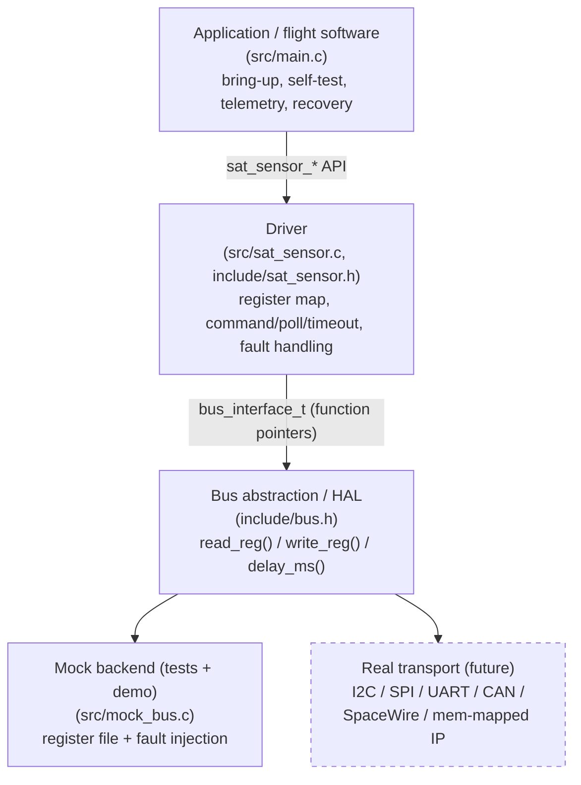
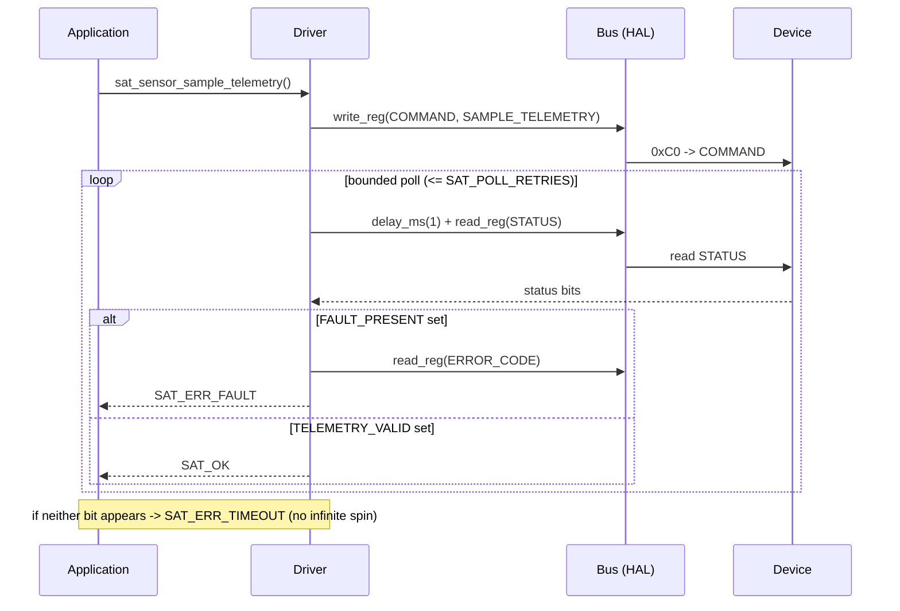

# Architecture

## Layers (diagram)



The driver depends only on the HAL contract, so swapping the mock backend for a
real transport requires **no driver changes** — only a new bus implementation.

## Command sequence (telemetry sample)



## Layers (ASCII fallback)

```
+-------------------------------------------------------------+
|  Application / flight software  (src/main.c)                |
|  - bring-up sequence, self-test, telemetry, fault recovery  |
+----------------------------+--------------------------------+
                             | sat_sensor_* API
                             v
+-------------------------------------------------------------+
|  Driver  (src/sat_sensor.c, include/sat_sensor.h)           |
|  - register map + status/command semantics                  |
|  - command/poll/timeout logic, fault & error handling       |
|  - returns a single sat_status_t contract                   |
+----------------------------+--------------------------------+
                             | bus_interface_t (function ptrs)
                             v
+-------------------------------------------------------------+
|  Bus abstraction / HAL  (include/bus.h)                     |
|  read_reg() / write_reg() / delay_ms()                      |
+----------------------------+--------------------------------+
                             |
              +--------------+---------------+
              v                              v
+---------------------------+   +-----------------------------+
|  Mock backend (tests/demo)|   |  Real transport (future)    |
|  src/mock_bus.c           |   |  I2C / SPI / UART / CAN /    |
|  register file + faults   |   |  SpaceWire / mem-mapped IP   |
+---------------------------+   +-----------------------------+
```

## Why this shape

The driver is written against the **bus abstraction**, never against a concrete
transport. The contract is three function pointers (`read_reg`, `write_reg`,
`delay_ms`). This is the same separation real embedded drivers use: the chip
driver knows the register map and protocol; a board support package (BSP)
provides the actual bytes-on-the-wire transport.

Benefits demonstrated here:

- **Portability:** the same driver runs on the host (mock) and would run on a
  target by swapping only the bus implementation.
- **Testability:** the mock backend injects wrong IDs, bus errors, timeouts,
  faults, and invalid telemetry, so every error path is covered without
  hardware — a software stand-in for hardware-in-the-loop (HIL) testing.
- **No dynamic allocation:** the caller owns the `sat_sensor_t` handle; the
  driver allocates nothing, which suits memory-constrained flight environments.
- **Bounded waits:** command completion is polled a fixed number of times, so
  a misbehaving device yields `SAT_ERR_TIMEOUT` instead of hanging the task.

## Control flow: a command

`sat_sensor_run_self_test()` and `sat_sensor_sample_telemetry()` share one
internal helper, `issue_command()`:

1. Write the opcode to `COMMAND`.
2. Poll `STATUS` up to `SAT_POLL_RETRIES` times, delaying between reads.
3. If `FAULT_PRESENT` appears, cache `ERROR_CODE` and return `SAT_ERR_FAULT`.
4. If the expected status bit(s) are set, return `SAT_OK`.
5. Otherwise return `SAT_ERR_TIMEOUT`.

## Mapping to the Airbus role

| Role keyword                | Where it shows up here                              |
|-----------------------------|----------------------------------------------------|
| Device driver development   | `sat_sensor.c` register-level driver               |
| Software/hardware interfaces| `bus.h` abstraction + register map                 |
| BSP development             | the bus backend is the swappable, board-specific part |
| HIL / functional validation | mock backend + fault injection in `tests/`         |
| RTOS / debugging / testing  | bounded polling, status/fault handling, unit tests |
| C/C++, Python               | C driver; optional Python checker in `tools/`      |
